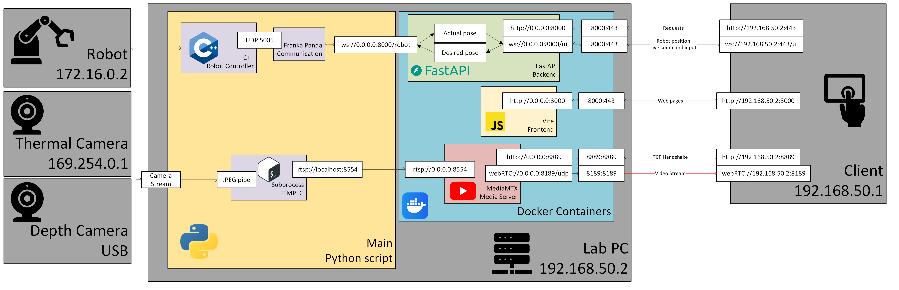

# Laser-Stylus-MQP

This repository is for the control of a robotic arm with surgical laser end effector by a touchscreen interface.

Traditional transoral laryngeal microscopy uses an endoscope operated by hand to excise tumors on the vocal fold. The goal of this project is to build on traditional systems such as the free beam µRALP robot (Mattos et al. 2021) by implementing a touchscreen interface to enhance situational awareness, improve control, enhance safety, and reduce the surgeon's cognitive load.

## Building

This project was configured to build locally for testing and in the COMET lab for deployment.

- Run on lab PC:`docker-compose up`
- Run locally: `docker-compose --profile mock_robot up --build`

## Pages
- [Home](http://localhost:3000)
- [Docs](http://localhost:443/docs)
- [Camera stream (HTML)](http://localhost:3000/videostream.html)